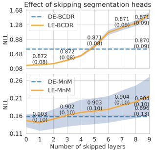

### Table of contents
- [Description](#description)
  - [Method](#method)
  - [How to apply Layer Ensembles to your model](#how-to-apply-layer-ensembles-to-your-model)
- [Results](#results)
  - [Segmentation and Calibration](#segmentation-and-calibration)
  - [Qualitative examples](#qualitative-examples)
  - [Correlation of uncertainty metrics with segmentation performance](#correlation-of-uncertainty-metrics-with-segmentation-performance)
  - [Tuning the Negative Log Likelihood](#tuning-the-negative-log-likelihood)
- [How to cite](#how-to-cite)

---

## Description

&#128679; **The source code is still being migrated from a private repository.**

### Method

**Layer Ensembles** - is a method for uncertainty estimation in deep learning using a single network and a single pass (see [this paper](https://arxiv.org/abs/2203.08878)).

The main idea of Layer Ensembles is to attach an output head to intermediate layers of a network at different depths like in the following example:

<div style="text-align:center">

</div>

Then, the outputs can be combined as an ensemble of networks of different depths. We tested this idea for two medical image segmentation tasks: 1) binary -- breast mass segmentation; and 2) multi-class -- cardiac structure segmentation.

**AULA** - Area Under Layer Agreement curve is a new image-level uncertainty metric that is derived from the sequential nature of the Layer Ensembles method.

It is a known phenomenon in Deep Learning that early layers generalise and deep layers memorise. So the easy samples (i.e. most common and in-distribuion) will be already adequately segmented in the early layers and in the following all consequitve layers -- drawing a high agreement between all the adjacent layers. However, these early layers will have much less agreement for the difficult samples (i.e. less common and out-of-distribution).

Look at this example for mass segmentation (blue -> prediction; green -> ground truth):

<div style="text-align:center">

</div>

In (a), we have a high contrast lesion with clear boundaries to the surrounding tissue. Hence, we observe a high agreement between the segmentation predictions for all the layers. We calculate the agreement between two layers using the Dice Coefficient. Then, we can calculate the **Area Under Layer Agreement** curve as shown in the shaded blue area.

In (b), we have a mass that has a low contrast to the surrounding tissue and the calcification pathology is present. This example is one of the difficult samples. We can see the agreement in the early layers is low. Hence, low **AULA**.

In the results below, you can see that AULA correlates well with the segmentation performance metrics. I.e., high AULA for good segmentation and low AULA for poor segmentation. **This allows detecting filed segmentation automatically.**

---

### How to apply Layer Ensembles to your model

1. Load any model
    
    ```python
    from torchvision.models import resnet18
    architecture = resnet18(weights=None, num_classes=2)
    ```
    
2. Import the LayerEnsembles wrapper and the task Enum (e.g., segmentation, classification, regression)

    ```python
    from methods.layer_ensembles import LayerEnsembles
    from utils import Task
    ```
    This is an example for importing them in ```main.py```.
    **At the moment, we only support Task.SEGMENTATION**

3. Get the names of all the layers in your model

    ```python
    all_layers = dict([*architecture.named_modules()])
    intermediate_layers = []
    for name, layer in all_layers.items():
        if '.relu' in name:
            intermediate_layers.append(name)
    ```
    You can change .relu to any other component e.g., .bn or .conv the '.' is to include only sub-modules (exclude stem)

4. Init LayerEnsembles with the names of the intermediate layers to use as outputs
    ```python
    model = LayerEnsembles(architecture, intermediate_layers)
    # Dummy input to get the output shapes of the layers
    x = torch.randn(1, 1, 128, 128)
    output = model(x)
    out_channels = []
    for key, val in output.items():
        out_channels.append(val.shape[1])
    # Set the output heads with the number of channels of the output layers
    model.set_output_heads(in_channels=out_channels, task=Task.SEGMENTATION, classes=2)
    ```

5. You can also check the output shapes

    ```python
    outputs = model(x)
    print(len(outputs))
    for layer, out in outputs.items():
        print(layer, out.shape)
    ```

6. Training goes as usual, but note that the ```outputs``` is a dictionary with tensor values corresponding for each output head name as keys. Thus, we calculate the ```total_loss``` as the sum of each output heads and then backpropagate.

    ```python
    model.train()
    total_loss = 0
    outputs = model(x)
    losses = [criterion(output, target) for _, output in outputs.items()]
    for loss in losses:
        total_loss = total_loss + loss
    total_loss.backward()
    optimizer.step()
    ```
    Feel free to modify the loss functions and how the total loss is calculated.

7. In testing, the output ```list``` contains predictions from each head. You can combine them in any way you like (e.g., averaging, STAPLE).

---

## Results

### Segmentation and Calibration

We compare the segmentation and uncertainty estimation performance against the state-of-the-art Deep Ensembles (DE), where *M* randomly initilised models are trained with the same data and their outputs are combined to get the final prediction. Also, we compare Layer Ensembles (LE) with another single pass and single network approach Multi-Head Ensembles method (MH) as well as a Plain model without any uncertainty estimation (referred as Plain).

**Table 1.** Segmentation and confidence calibration performance for Plain U-Net, MH, DE, and LE on BCDR and MnM datasets. The values for DSC, MHD, and NLL are given as mean(std). ↑- higher is better, ↓ - lower is better. Best values are in bold. Statistically significant differences compared to LE are indicated by *.

<center>
<table>
    <tr>
        <td></td>
        <td colspan=3 align=center>BCDR -- breast mass segmentation</td>
        <td></td>
        <td colspan=3 align=center>MnM -- all structures combined</td>
    </tr>
    <tr>
        <td>Method</td>
        <td>DSC↑</td>
        <td>MHD ↓</td>
        <td>NLL ↓</td>
        <td></td>
        <td>DSC ↑</td>
        <td>MHD ↓</td>
        <td>NLL ↓</td>
    </tr>
    <tr>
        <td>Plain</td>
        <td>*0.865(0.089)</td>
        <td>*1.429(1.716)</td>
        <td>*2.312(1.353)</td>
        <td></td>
        <td>0.900(0.114)</td>
        <td><b>1.061(2.693)</b></td>
        <td>0.182(0.405)</td>
    </tr>
    <tr>
        <td>MH</td>
        <td>*0.865(0.090)</td>
        <td>*1.457(1.826)</td>
        <td>*2.191(1.305)</td>
        <td></td>
        <td>*0.892(0.128)</td>
        <td>1.418(3.865)</td>
        <td>*0.228(0.582)</td>
    </tr>
    <tr>
        <td>DE</td>
        <td>0.870(0.090)</td>
        <td>1.373(1.762)</td>
        <td>*0.615(0.538)</td>
        <td></td>
        <td>*0.896(0.129)</td>
        <td>1.465(4.856)</td>
        <td>*<b>0.157(0.331)</b></td>
    </tr>
    <tr>
        <td>LE</td>
        <td><b>0.872(0.084)</b></td>
        <td><b>1.317(1.692)</b></td>
        <td><b>0.306(0.250)</b></td>
        <td></td>
        <td><b>0.903(0.103)</b></td>
        <td>1.302(5.308)</td>
        <td>0.173(0.367)</td>
    </tr>
    <tr>
        <td></td>
        <td colspan=3 align=center>MnM -- Structure-wise DSC ↑</td>
        <td></td>
        <td colspan=3 align=center>MnM -- Structure-wise MHD ↓</td>
    </tr>
    <tr>
        <td>Method</td>
        <td>LV</td>
        <td>MYO</td>
        <td>RV</td>
        <td></td>
        <td>LV</td>
        <td>MYO</td>
        <td>RV</td>
    </tr>
    <tr>
        <td>Plain</td>
        <td>0.882(0.131)</td>
        <td>*0.804(0.124)</td>
        <td>*0.826(0.151)</td>
        <td></td>
        <td><b>1.313(3.625)</b></td>
        <td><b>1.303(2.788)</b></td>
        <td>2.884(10.888)</td>
    </tr>
    <tr>
        <td>MH</td>
        <td>*0.871(0.149)</td>
        <td>*0.798(0.129)</td>
        <td>0.827(0.160)</td>
        <td></td>
        <td>1.693(5.640)</td>
        <td>1.651(3.957)</td>
        <td>2.148(4.825)</td>
    </tr>
    <tr>
        <td>DE</td>
        <td><b>0.885(0.137)</b></td>
        <td>*0.804(0.135)</td>
        <td>0.829(0.164)</td>
        <td></td>
        <td>1.536(5.596)</td>
        <td>1.500(3.983)</td>
        <td><b>2.113(5.671)</b></td>
    </tr>
    <tr>
        <td>LE</td>
        <td>0.883(0.128)</td>
        <td><b>0.809(0.108)</b></td>
        <td><b>0.832(0.144)</b></td>
        <td></td>
        <td>1.525(5.861)</td>
        <td>1.529(5.497)</td>
        <td>2.525(8.925)</td>
    </tr>
</table>
</center>

---

### Qualitative examples

Here are some examples of segmentation outputs and uncertainty heatmaps based on variance. DE's uncertainty maps are overconfident, while LE manages to highlight the difficult areas. The difficult area examples are indicated by red arrows: 1) in breast mass segmentation, the bottom left part of the mass has a low contrast and smoothly merges to the background; 2) in cardiac segmentation, we are looking at the base of the heart where the right ventricle branches out to pulmonary trunk, that's where the lower intensity region appears making it confusing to the segmentation models.

<div style="text-align:center">

</div>

**Figure 1.** Examples of visual uncertainty heatmaps based on variance for high uncertainty areas (red arrows) using LE (top) and DE (bottom) for breast mass and cardiac structure segmentation. Black and green contours correspond to ground truth.

---

### Correlation of uncertainty metrics with segmentation performance

**Table 2.** Spearman's correlation of segmentation metrics with uncertainty metrics for breast mass and cardiac segmentation tasks. Absolute highest values are shown in bold.

<center>
<table>
    <tr>
        <td></td>
        <td colspan=4 align=center>BCDR</td>
        <td></td>
        <td colspan=4 align=center>MnM</td>
    </tr>
    <tr>
        <td></td>
        <td>Entropy</td>
        <td>MI</td>
        <td>Variance</td>
        <td>AULA</td>
        <td></td>
        <td>Entropy</td>
        <td>MI</td>
        <td>Variance</td>
        <td>AULA</td>
    </tr>
    <tr>
        <td>DE-DSC</td>
        <td>-0.783</td>
        <td>-0.785</td>
        <td><b>-0.785</b></td>
        <td>N/A</td>
        <td></td>
        <td>-0.323</td>
        <td>-0.433</td>
        <td>-0.377</td>
        <td>N/A</td>
    </tr>
    <tr>
        <td>LE-DSC</td>
        <td>-0.615</td>
        <td>-0.597</td>
        <td>-0.620</td>
        <td><b>0.785</b></td>
        <td></td>
        <td>-0.221</td>
        <td>-0.207</td>
        <td>-0.203</td>
        <td><b>0.649</b></td>
    </tr>
    <tr>
        <td>DE-MHD</td>
        <td>0.762</td>
        <td><b>0.764</b></td>
        <td>0.763</td>
        <td>N/A</td>
        <td></td>
        <td>0.401</td>
        <td>0.499</td>
        <td>0.447</td>
        <td>N/A</td>
    </tr>
    <tr>
        <td>LE-MHD</td>
        <td>0.594</td>
        <td>0.575</td>
        <td>0.598</td>
        <td>-0.730</td>
        <td></td>
        <td>0.309</td>
        <td>0.313</td>
        <td>0.300</td>
        <td><b>-0.571</b></td>
    </tr>
</table>
</div>
</center>

We can see here a very good correlation of the AULA metric compared to the DE's Variance, MI, and Entropy uncertainty metrics. How is this useful? We can detect poor segmentation samples automatically and ask the clinicians to manually revise them. For example, the figure below is a demonstration of such automatic failure detection using the uncertainty.

<div style="text-align:center">

</div>

**Figure 2.** Segmentation quality control for DE and LE. The following are averaged indicators for: random flagging (dashed black); remaining 5% of poor segmentations (dotted grey); and ideal line (grey shaded area).

---

### Tuning the Negative Log Likelihood

Since we attach the output heads sequentially, we can skip the early layers outputs to tune the NLL to our needs. In some tasks, depending on the complexity of the the segmentation, skipping the initial heads actually helps to improve the correlation. In Table 2, we presented the correlation scores by skipping the initial 3 and 5 output heads for mass and cardiac segmentation problems, respectively.

Below, you can see the effect of skipping layer outputs to the NLL metric. Note that we do not compromise the segmentation performance by skipping any number of output heads.
<div style="text-align:center">

</div>

**Figure 3.** The effect of skipping initial segmentation head outputs on model calibration. Numbers on top of the lines represent DSC in mean(std) format. Shaded areas are standard deviations for NLL.

---

## How to cite

```LaTeX
@article{kushibar2022layer,
  title={Layer Ensembles: A Single-Pass Uncertainty Estimation in Deep Learning for Segmentation},
  author={Kushibar, Kaisar and Campello, Víctor and Garrucho, Lidia and Linardos, Akis and Radeva, Petia and Lekadir, Karim},
  journal={arXiv preprint arXiv:2203.08878},
  year={2022}
}
```